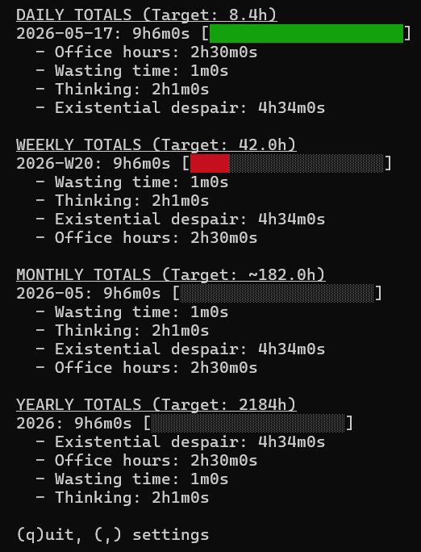

# tuitime

A professional, terminal-based time tracking suite with real-time visualization, goal tracking, and scalable log management.

## Features

- **Unified Application:** Access timer setup, historical day management, and reports from a single hub.
- **Smart Setup:** Focused screen for Start Time, End Time, and Comments with real-time validation.
- **Timer Modes:** Log time in real-time or retrospectively with manual entry.
- **Advanced Day View:** Navigate, edit, or delete any entry in your history with full Undo support.
- **ASCII Clock:** Choose between Plain Text, Small (5-row), or Large (7-row) blocky clocks.
- **Customizable Themes:** Cycle through 7 colors for your timer display.
- **Goal Visualization:** Heatmaps and progress bars based on your custom weekly hour target.
- **Intelligent Autocomplete:** Remembers your 50 most recent unique comments with instant filtering.
- **Scalable Logs:** Automatically organizes entries into `logs/YYYY/MM-MonthName.md`.

---

## Visual Preview

### 1. Main Setup & Menu
```text
tuitime

[Timer]   Reports   Day View   Settings

Session Setup [TIMER]

Start Time: 09:00
End Time:   _________________________________
Comment:    Cod|

Suggestions:
 • Coding          <-- Selected
 • Code Review
 • Documentation
```

### 2. Large ASCII Clock


### 3. Daily/Weekly/Monthly Reports


---

## Installation & Usage

### Binaries
Pre-compiled binaries for Linux, macOS, and Windows are available in the **Releases** section of this repository.

### Running
1. **Launch Hub:** Run `tuitime`.
2. **Navigate:** Use **Arrow Keys (Up/Down)** to move between the top menu and the input fields.
3. **Select View:** Use **Left/Right** on the top menu to select a tool and press **Enter**.
4. **Exit:** Press **q** or **Esc** while the top menu is focused to quit.

### Controls
- **Timer:** 
    - **p** - Pause/Resume.
    - **t** - Switch tasks (logs current and starts new).
    - **s** - Stop and log.
    - **,** - Change clock settings.
- **Day View:** 
    - **Arrows** - Navigate entries and days.
    - **Enter** - Edit field in-place.
    - **a** - Add manual entry for the current day.
    - **del** - Delete entry.
    - **u** - Undo current session changes.

---

## Building from Source

If you have Go installed, you can build tuitime yourself:

1. Clone the repository:
   ```bash
   git clone https://github.com/Trez-zerT/TUI-timer.git
   cd TUI-timer/timetracker-code
   ```
2. Build for your current platform:
   ```bash
   go build -o tuitime time-tracker.go
   ```
3. To cross-compile for all platforms:
   ```bash
   GOOS=linux GOARCH=amd64 go build -o tuitime-linux time-tracker.go
   GOOS=darwin GOARCH=arm64 go build -o tuitime-macos time-tracker.go
   GOOS=windows GOARCH=amd64 go build -o tuitime-windows.exe time-tracker.go
   ```

---

## Log Structure
Logs are stored relative to the executable:
```text
.
├── logs/
│   └── 2026/
│       ├── 05-May.md
│       └── 06-June.md
├── config.json
└── recent_comments.json
```

## License
MIT License - see `LICENSE` for details.
