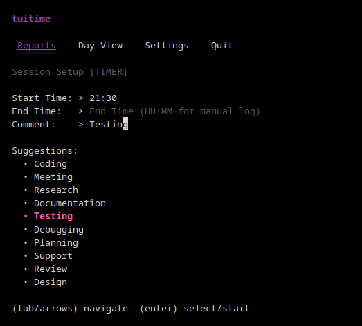
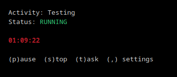
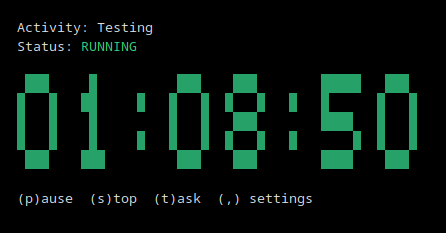
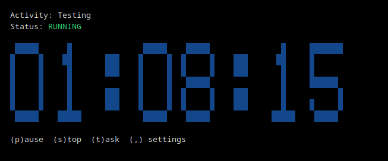
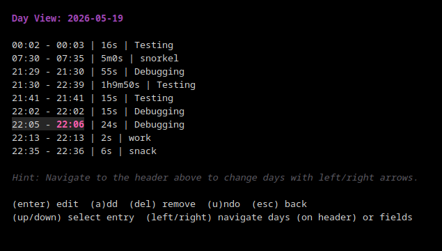
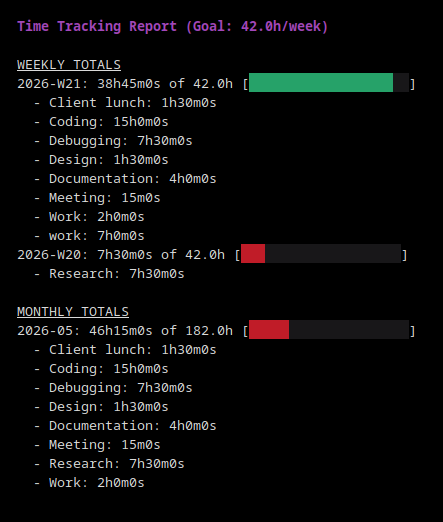
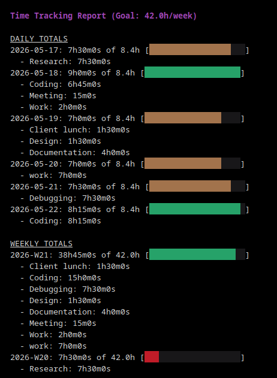
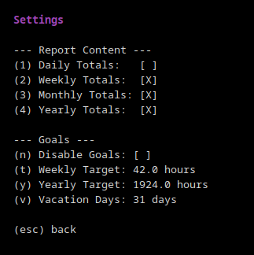

# tuitime

A professional, terminal-based time tracking suite with real-time visualization, goal tracking, and scalable log management.

## Features

- **Unified Application:** Access timer setup, historical day management, and reports from a single hub.
- **Smart Setup:** Focused screen for Start Time, End Time, and Comments with real-time format validation.
- **Timer Modes:** Log time in real-time or retrospectively with manual entry.
- **Advanced Day View:** Navigate through time, edit entries in-place, delete them, or add new retrospective logs.
- **Full Undo:** Made a mistake? Press **u** in the Day View to instantly revert all changes from your current session.
- **High-Res ASCII Clock:** Choose between Plain Text, Small (5-row), or Large (7-row) blocky clocks.
- **Customizable Themes:** Cycle through 7 colors for your timer display.
- **Goal Visualization:** Heatmaps and progress bars (e.g., "34h of 40h") based on your custom targets.
- **Flexible Goals:** Set a **Weekly** or **Yearly** target and the app will synchronize the other automatically.
- **Vacation Support:** Specify vacation days per year and the app will automatically adjust your work targets to compensate.
- **Report Customization:** Toggle the visibility of Daily, Weekly, Monthly, and Yearly sections.
- **Intelligent Autocomplete:** Remembers your 50 most recent unique comments with instant, non-destructive navigation.
- **Scalable Logs:** Automatically organizes entries into `logs/YYYY/MM-MonthName.md`.

---

## Visual Preview

### 1. Timer Setup & Navigation


### 2. Live Tracking (Multiple Clock Modes)
| Plain Text | Small ASCII | Large ASCII |
| :---: | :---: | :---: |
|  |  |  |

### 3. Advanced Day View (Historical Editing)


### 4. Reports & Heatmaps



### 5. Goal & Vacation Settings


---

## Installation & Usage

### Binaries
### Binaries
Pre-compiled binaries for the following platforms are available in the **Releases** section:

| Platform | Architecture | Recommended Use |
| :--- | :--- | :--- |
| **Linux** | `amd64` | Standard PCs, Servers |
| **Linux** | `arm64` | Raspberry Pi 4/5 (64-bit OS) |
| **Linux** | `armv7` | Raspberry Pi 3/4 (32-bit OS) |
| **macOS** | `arm64` | Apple Silicon (M1/M2/M3) |
| **macOS** | `amd64` | Intel-based Macs |
| **Windows** | `amd64` | Standard PCs |
| **Windows** | `arm64` | Windows on ARM devices |
| **FreeBSD** | `amd64` | Servers |

### Running
1. **Launch Hub:** Run `tuitime`.
2. **Navigate:** Use **Arrow Keys (Up/Down)** to move between the top menu and the input fields.
3. **Select View:** Use **Left/Right** on the top menu to select a tool and press **Enter**.
4. **Exit:** Press **q** or **Esc** while the top menu is focused to quit.

### Controls
- **Timer:** 
    - **p** - Pause/Resume.
    - **t** - Switch tasks (logs current and starts new).
    - **s** - Stop and log.
    - **,** - Change clock settings.
- **Day View:** 
    - **Arrows** - Navigate entries and days (navigate to header to change day).
    - **Enter** - Edit field in-place.
    - **a** - Add manual entry for the current day.
    - **del** - Delete entry.
    - **u** - Undo current session changes.
- **Reports:**
    - **Arrows** - Scroll through long reports.
    - **PgUp/PgDown** - Fast scroll.
    - **,** - Change target and visibility settings.

---

## Building from Source

If you have Go installed, you can build tuitime yourself:

1. Clone the repository:
   ```bash
   git clone https://github.com/Trez-zerT/TUI-timer.git
   cd TUI-timer/timetracker-code
   ```
2. Build for your current platform:
   ```bash
   go build -o tuitime time-tracker.go
   ```
3. To cross-compile for all platforms:
   ```bash
   GOOS=linux GOARCH=amd64 go build -o tuitime-linux time-tracker.go
   GOOS=darwin GOARCH=arm64 go build -o tuitime-macos time-tracker.go
   GOOS=windows GOARCH=amd64 go build -o tuitime-windows.exe time-tracker.go
   ```

---

## Log Structure
Logs are stored relative to the executable:
```text
.
├── logs/
│   └── 2026/
│       ├── 05-May.md
│       └── 06-June.md
├── config.json
└── recent_comments.json
```

## License
MIT License - see `LICENSE` for details.
