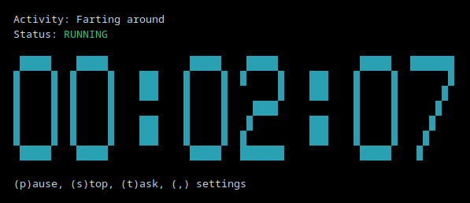

# TUI Timer & Reporter

A sleek, terminal-based time tracking suite with real-time visualization, goal tracking, and scalable log management.

## Features

### tuitime (Tracker)
- **Easy Setup:** Unified screen for Start Time, Manual Time Entry, and Comments.
- **Live & Manual Modes:** Log time in real-time or retrospectively.
- **High-Res ASCII-styæe Clock:** Choose between Plain Text, Small (5-row), or Large (7-row) blocky clocks.
- **Customizable Themes:** Cycle through 7 colors for your timer display.
- **Intelligent Autocomplete:** 
    - Remembers your **50 most recent** unique comments.
    - Shows **top 10** most recent entries immediately when the field is empty.
    - Instant filtering as you type.

### timesleuth (Reporter)
- **Scalable Logs:** Automatically organizes entries into easily human-readable `logs/YYYY/MM-MonthName.md`.
- **Goal Visualization:** Heatmaps/Progress bars based on your custom weekly hour target.
- **Flexible Tracking:** Enable/Disable work goals at any time.
- **Comprehensive Overviews:** Daily (Oldest -> Newest), Weekly, Monthly, and Yearly totals.

---

## Visual Preview

### 1. Timer Setup [Live Mode]
```text
Session Setup [LIVE TIMER]

Start Time: 09:00
End Time:   _________________________________
Comment:    Cod|

Suggestions:
  • Coding          <-- Selected
  • Code Review
  • Documentation
```

### 2. Large ASCII Clock [Running]


### 3. Reporter with Progress Heatmaps
```text
Time Tracking Report (Goal: 40.0h/week)

DAILY TOTALS (Target: 8.0h)
2026-05-17: 8h30m [████████████████████]
  - Coding: 6h0m
  - Meeting: 2h30m

WEEKLY TOTALS (Target: 40.0h)
2026-W20: 34h15m [█████████████████░░░]
  - Development: 34h15m
```

---

## Installation & Usage

### Binaries
Binaries for Linux, macOS, and Windows will soon be available in the **Releases** section of this repository.

### Running
1. **Track Time:** Run `tuitime` to start logging.
2. **View Reports:** Run `timesleuth` to see your progress.
3. **Configure:** Press `,` in either application to open settings.

## Log Structure
Logs are stored relative to the executable:
```text
.
├── logs/
│   └── 2026/
│       ├── 05-May.md
│       └── 06-June.md
├── config.json
└── recent_comments.json
```

## License
MIT License - see `LICENSE` for details.
